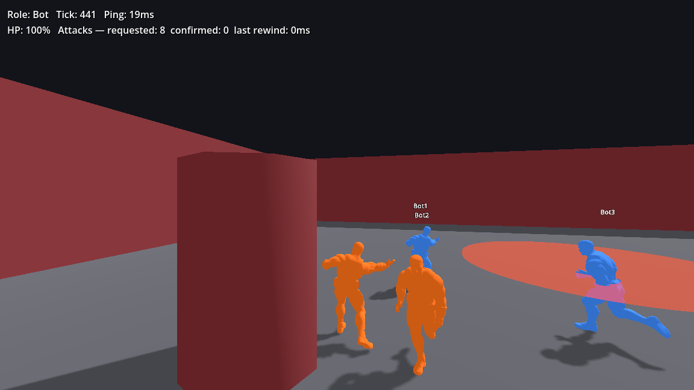

# The Room

**A fast, funny knife-fight deathmatch in one room**, where every character is a caricature of the
developer who built them. Made by the **Voidra** team with Godot 4.7 (.NET / C#).



## Features

- **Third-person knife combat:** light, heavy lunge, execute from behind, an invulnerable dodge
  roll, sprint and jump.
  Every hit is decided by the server with lag compensation, so every death is explainable.
- **One ability per character,** built on a grammar the code enforces: every ability has a
  visible tell and a cooldown, and can be countered.
- **Match rules:** bounties on streaking players, a Golden Knife that makes every hit lethal,
  Last Call, and end-of-match awards.
- **Rooms:** a permanent public room, plus player-created public or private rooms joined with a
  5-letter code.
- **Match history & season leaderboard,** paginated, with the full scoreboard of every match.
- **Pluggable characters:** any humanoid model plays the shared animations through Godot's
  humanoid retargeting.


## Quick start

Requirements: **Godot 4.7.2 .NET** and the **.NET SDK 8+**.

```bash
git clone https://github.com/Voidra-iq/the-room.git && cd the-room
make setup            # restore packages + build
make run-local N=2    # a local server + 2 windowed clients
```

To play online, open the project in Godot and press **Play**. The main menu connects to the
public lobby, where you can join the main room, create your own, or practice alone.

| Move | Look | Light | Heavy | Dodge | Sprint | Jump | Ability | Scoreboard | Menu |
|---|---|---|---|---|---|---|---|---|---|
| WASD | Mouse | LMB | RMB | Cmd / Ctrl | Shift (hold) | Space | E | Tab | Esc |

`make help` lists everything else: bots, a local lobby, animation preview, tests and deploy.

**Builds:** `make export-mac` makes `build/macos/The Room.app` (universal), and
`make export-client` makes the Windows build. See [Building the game](docs/building.md).

## Documentation

Everything is in **[`docs/`](docs/intro.md)**:

- [Getting started](docs/getting-started.md): setup, controls, command-line flags.
- [Architecture](docs/architecture/Intro.md): networking, sessions, match loop.
- [Gameplay](docs/gameplay/Intro.md): combat, abilities, tuning.
- [Characters & animation](docs/characters/Intro.md): adding models and clips.
- [Lobby service](docs/lobby/Intro.md): rooms, HTTP API, match history.
- [Testing](docs/testing.md), [Deployment](docs/deployment.md), and
  [Server configuration](docs/server-config.md) (installing on a new server).

The build plan and change log are in [`plan/main.md`](plan/main.md).

## Tech

| Part | Stack |
|---|---|
| Game client & room servers | Godot 4.7.2 (.NET), C#, ENet (UDP), Jolt physics |
| Lobby | ASP.NET Core minimal API (.NET 8), SQLite |
| Hosting | Linux + systemd + nginx; the API sits behind Cloudflare, and gameplay UDP goes direct |
| Tests | GoDotTest (game), xUnit (lobby) |

## Status

Playable, but pre-alpha and grey-box:

- the arena is block geometry;
- there's one character model (Zain) with run, jump and stab animations;
- the two abilities are framework examples until real designers claim their characters.

See [`plan/main.md`](plan/main.md) for phase-by-phase status.

## Contributing

- Design rules and code style live in [`CLAUDE.md`](CLAUDE.md) and the `CLAUDE.md` in each major
  folder.
- Gameplay numbers only go in `tuning/tuning.tres`.
- Run `make test` before you push, and update `docs/` in the same change as the code.

## Credits

Made by the **Voidra** team.

- Character model and animations from [Mixamo](https://www.mixamo.com).
- Arena props and textures from [Poly Haven](https://polyhaven.com) (CC0), controller icons, effect textures and sound effects from [Kenney](https://kenney.nl) (CC0), music "EmptyCity" by yd (CC0). See [CREDITS.md](CREDITS.md).
- Built with [Godot Engine](https://godotengine.org).

## License

No license has been chosen yet, so all rights are reserved by the Voidra team. Please ask before
reusing the code or assets.
