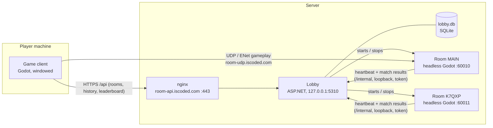

# Architecture

Three kinds of process make up a running game:

- **Game client:** the Godot project with a window. It opens the main menu, which talks to the
  lobby over HTTPS, and then connects straight to a room's game server over UDP.
- **Room game server:** the same Godot project, run headless with `--server`. It's authoritative
  for everything in its match. One process per room.
- **Lobby:** a small ASP.NET service. It starts and stops room processes, lists rooms, and stores
  finished matches. It never touches gameplay traffic.

Gameplay never goes through HTTP or Cloudflare's proxy. `room-udp` is a DNS-only record, because
Cloudflare's proxy only carries HTTP.

## Pages

- [Networking](networking.md): authority, prediction and reconciliation, interpolation, rewind
  hit detection, RPC patterns.
- [Sessions &amp; scenes](sessions-and-scenes.md): how one client moves between the menu, rooms and
  practice.
- [Match loop](match-loop.md): what the server runs during a match, and what it reports.

For the lobby's side, see [Lobby service](../lobby/Intro.md).

## Where things live

| Concern                          | Code                   |
| -------------------------------- | ---------------------- |
| Session and connection           | `core/Net.cs`          |
| Player movement, combat, bots    | `player/Player.cs`     |
| Hit detection with rewind        | `core/CombatServer.cs` |
| Match rules                      | `core/MatchServer.cs`  |
| Talking to the lobby (room side) | `core/RoomReporter.cs` |
| Talking to the lobby (menu side) | `core/LobbyApi.cs`     |
| Lobby                            | `services/lobby/`      |
