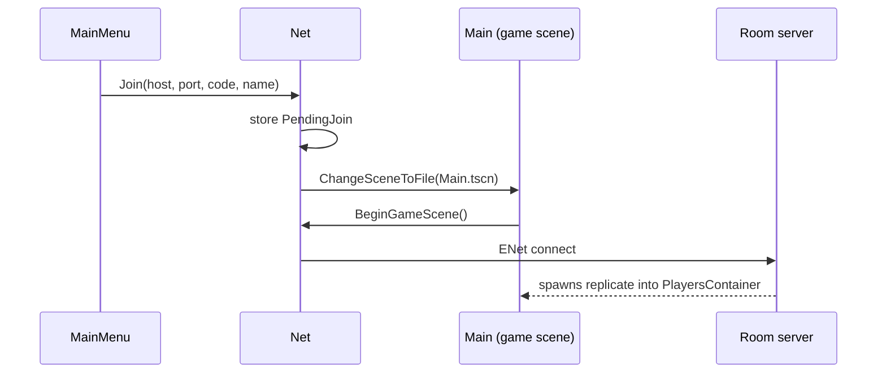

# Sessions & scenes

One game client can go **menu → room → menu → practice → another room** without restarting.
`core/Net.cs` owns that flow as a small state machine.

## Modes

| `Net.Mode` | Meaning | Entered by |
|---|---|---|
| `None` | At the main menu, no game running | Start-up with no flags, or `Net.Leave()` |
| `Offline` | Practice: one local player, no server | Menu → Practice, or running `Main.tscn` straight from the editor |
| `Server` | Dedicated headless server | `--server` (or a headless display without `--connect`) |
| `Client` | Connected (or connecting) to a room | Menu join, or `--connect` |

`Net.IsServer`, `IsClient` and `IsOffline` are live views of `Mode`. **Always read them live**; never
cache them in `_Ready`, because the mode changes after start-up.

## Scenes

- `ui/MainMenu.tscn` is the **project main scene**. If the mode is already `Server`, or a join is
  queued from `--connect`, it switches straight to the game scene.
- `core/Main.tscn` is the game scene: the arena, the players container and spawner, the killfeed,
  the debug overlay and the in-game menu.

## Joining a room

The client connects **after** `Main` has loaded, on purpose. The server's MultiplayerSpawner
replicates player nodes as soon as a peer connects, and they need `Main/PlayersContainer` to
exist. `--connect` goes through exactly the same path, so bots exercise it too.

While connecting, `ui/GameMenu` shows "Connecting to …". If the room doesn't answer within 12 s,
it gives up and returns to the menu.

## Leaving

`Net.Leave(reason)` closes the ENet peer, sets the mode to `None` and loads the menu. The menu
shows `reason` as a red notice. It's called from:

- the in-game menu's **Leave room** or **Back to menu** (no reason);
- `ConnectionFailed` / `ServerDisconnected` (with a reason);
- the connect timeout.

Bots (`--bot`) quit the process instead of opening the menu.

## Keeping sessions separate

Autoloads live for the whole process, so anything scoped to one session is reset at its edges:

| When | What resets |
|---|---|
| `Main._Ready` | `Net.BeginGameScene()` (connect or go offline), `MatchServer.BeginSession()` (fresh match, score target from config) |
| `Main._ExitTree` | Event unsubscriptions, `Main`'s static spawn and name tables, `MatchServer.EndSession()` (state cleared, knife visual removed) |

If you add state that belongs to one room or practice session, reset it in the same places.
