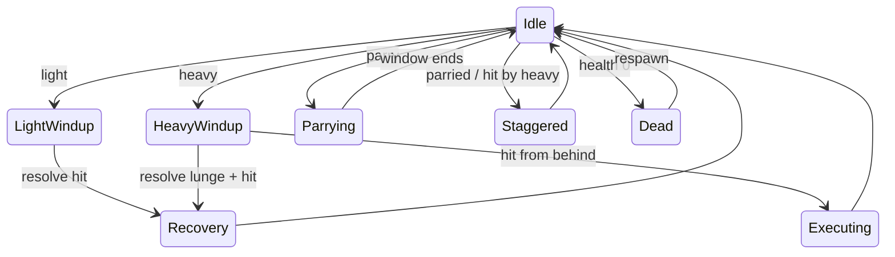

# Combat

All combat is resolved **on the server** (`player/Player.cs`, `core/CombatServer.cs`). A client only
asks to use a verb. The numbers below are the current values in `tuning/tuning.tres`.

## Verbs

| Verb | Input | Behaviour |
|---|---|---|
| **Light** | Left mouse | 0.12 s windup, 2 m reach, 35% health. 0.15 s recovery. |
| **Heavy lunge** | Right mouse | 0.4 s windup (a visible tell), then lunges up to 3 m and hits for 65% health. The victim is staggered 0.4 s. 0.6 s recovery, which is the punish window when it whiffs. |
| **Parry** | Q | 0.15 s window that negates **one** hit (light or heavy) and staggers the attacker 0.5 s. 3 s cooldown, which starts on the attempt, so a missed parry leaves you open. |
| **Execute** | Heavy from behind | A heavy that lands within 60° of the victim's back kills instantly. 0.6 s lock. |
| **Dash** | Shift | A 4 m burst in the direction you face. **No invulnerability frames.** 4 s cooldown. Only from idle, so you can't dash out of your own recovery. |
| **Jump** | Space | A small hop (about 0.8 m). Turn it off with `HopEnabled` for playtests. |
| **Ability** | E | One per character, see [Abilities](abilities.md). |

Health is 100. You respawn after 1.5 s (1.0 s during Last Call), with 1.5 s of spawn protection
(a white shimmer). Protection ends the moment you use any verb, including dash.

## State machine (per player, server-side)

Rock-paper-scissors: light beats a parry bait, heavy out-ranges light, and parry beats heavy.

## Fairness rules (Pillar 2)

- Hits are tested against where the target **was on the attacker's screen**, using server-side
  rewind capped at 0.2 s. See [Networking](../architecture/networking.md#hit-detection-with-rewind).
- The killfeed names the killer and the method (light / heavy / execute / ability name).
- A 1.5 s death camera turns you toward your killer.
- Swings, tells and deaths are shown from server broadcasts, so nothing you see is a guess.
