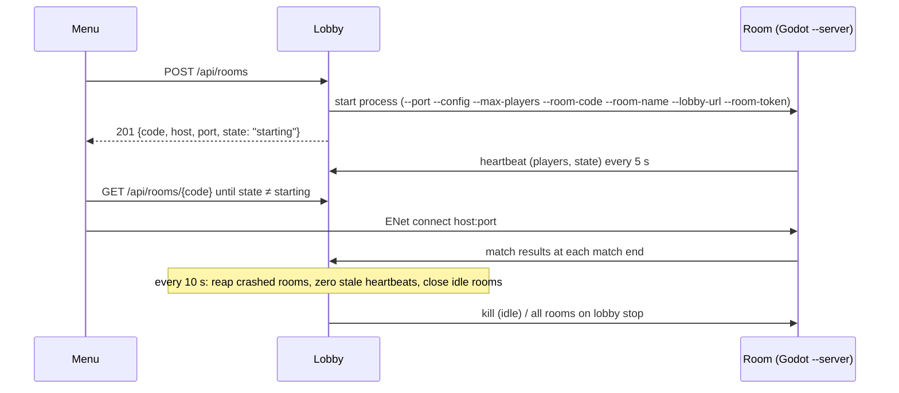

# Rooms

A **room** is one headless Godot game server process on its own UDP port, started and watched by
`services/lobby/RoomManager.cs`.

## Kinds

| | Main room | Player-created room |
|---|---|---|
| Code | `MAIN` | 5 random characters from `ABCDEFGHJKLMNPQRSTUVWXYZ23456789` (no 0/O, 1/I lookalikes) |
| Port | `MAIN_ROOM_PORT` (60010) | first free port in `ROOM_PORT_MIN`–`ROOM_PORT_MAX` |
| Listed | yes | only if public |
| Closed when empty | never | after `ROOM_IDLE_SECONDS` (5 min) with 0 players |
| If the process crashes | restarted (up to 20 times) | removed |
| Count limit | 1 | `MAX_ROOMS` (4) |

## Lifecycle

- The process is started with `ArgumentList`, never through a shell, because room names are
  player input.
- Each room gets a random 128-bit **token** that only the lobby and that process know. It
  authenticates the room's `/internal` calls.
- Room output goes to the lobby's log, prefixed with the room code (`journalctl -u the-room-lobby`).
- A heartbeat older than 30 s counts as 0 players.
- Stopping the lobby (`systemctl stop the-room-lobby`) stops every room, because systemd kills the
  whole control group.

## Limits and abuse

- **3 creates per IP per minute.** The IP comes from `CF-Connecting-IP` (Cloudflare), then
  `X-Forwarded-For`, then the socket address.
  - Caveat: someone who reaches the origin directly, bypassing Cloudflare, can forge those
    headers.
  - The hard cap `MAX_ROOMS` still bounds total resource use.
- Names are cleaned: control characters removed, whitespace collapsed, 24 characters at most.
- Each Godot room server uses about 210 MB of RAM. Size `MAX_ROOMS` to the machine.

## Sizing

| Machine | Suggested `MAX_ROOMS` |
|---|---|
| 2 GB RAM, 1–2 vCPU | 2 |
| 4 GB RAM, 2 vCPU (current, shared with other apps) | 4 |
| 8 GB RAM, 4 vCPU | 10 (widen the port range to match) |
