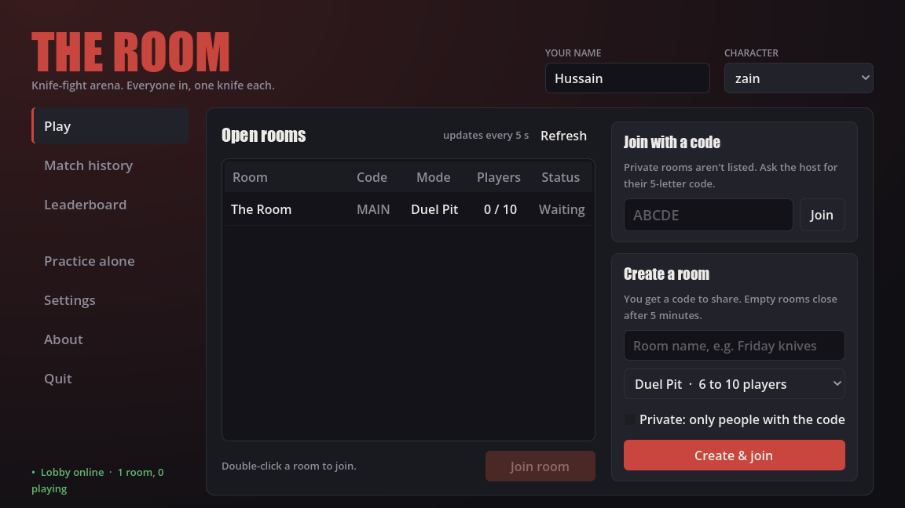
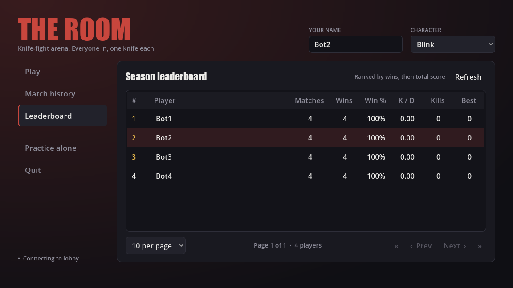
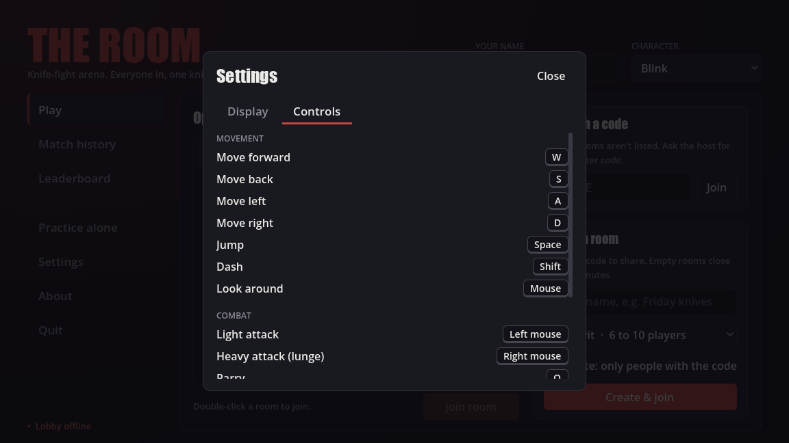

# Menus (UI)

All UI is built in C# (`ui/`) with one shared theme (`ui/UiTheme.cs`). There are no hand-authored
theme resources.

## Main menu (`ui/MainMenu.cs`, the project's main scene)

| Area | What it does |
|---|---|
| Header | Your **name** and **character**, saved to `user://settings.cfg`. On Windows that's `%APPDATA%\Godot\app_userdata\The Room\`; on macOS, `~/Library/Application Support/Godot/app_userdata/The Room/`. |
| **Play** | Room list (refreshes every 5 s; double-click or **Join room**), **Join with a code** for private rooms, and **Create a room** (name, Duel Pit or Chaos, private). Creating waits for the room's server to start, copies a private room's code to the clipboard, then joins. |
| **Match history** | Paginated table (when, room, winner, length, players). The newest match on the page opens in the details panel: full scoreboard (rank, player, character, points, kills, deaths), MVP and awards. **Only my matches** filters by your name. |
| **Leaderboard** | Season standings, paginated: matches, wins, win %, K/D, kills, best score. Top 3 in gold, your row highlighted. |
| Practice alone | Offline, with no server. |
| **Settings** | A dialog with two tabs. **Display:** "Display Mode" is Maximized (the default), Windowed or Fullscreen; it applies immediately, is saved, and is re-applied at every launch. **Controls:** the bindings of the device you're using: keyboard and mouse (with your layout's key names) or the controller (Xbox or PlayStation button icons). Click or select a binding, then press the new key or button; one already in use swaps with the old one. **Reset to defaults** resets that device only. Esc / Start cancels. |
| **About** | What the game is, "© 2026 Voidra Team", and a link to [github.com/Voidra-iq](https://github.com/Voidra-iq). |
| Status line | Whether the lobby is reachable, and how many rooms and players there are. |
| Notices | Errors (red, 12 s) and confirmations (green, 5 s) float at the bottom centre. Disconnect reasons from the last session show here too. |

Launching with `--server` or `--connect` skips the menu. For screenshots:

- `--menu-page=history|leaderboard` opens the menu on that page;
- `--menu-open=settings|controls|about` opens that dialog on top.

## In game: the HUD (`ui/PlayerHud.cs`, top-left, clients only)

- **Name** in the character's colour, and **HP** as numbers.
- **Red health bar,** in quarter segments. After a hit a pale **chip** holds for a moment, then
  slides down to the new value, so damage reads as a chunk falling away. It pulses when health
  is 30% or lower.
- **Green stamina bar** under it. Sprinting and dodging spend it, and it turns amber while
  exhausted.
- **Ability tile:** the key (E), a dark shade that drains downward as the ability recharges, the
  seconds left, and a pulsing gold border when it's ready. The ability's name is underneath.

Health and stamina come from the server (`Player.ReceiveServerState`), with stamina predicted
locally so the bar is smooth. The cooldown starts from the ability's tell. `ui/HudBar.cs` draws the
bars.

The developer overlay (ping, tick, rewind) moved to the bottom-left. It's shown in debug builds only,
and **F3** toggles it.

## In game: menus (`ui/GameMenu.cs`, part of `core/Main.tscn`, clients only)

- **Connecting overlay:** "Connecting to <room>…" with Cancel. It gives up after 12 s with a
  clear message.
- **Esc menu:** the room's name and **code** (with a Copy button, to invite friends), plus
  **Resume**, **Settings** (the same dialog as the main menu) and **Leave room** (**Back to menu**
  in practice). Esc closes the Settings dialog first, then the menu. The match keeps running; your
  character just stops taking input (`GameMenu.IsOpen`).
- **Tab:** scoreboard (`core/KillfeedUI.cs`), along with the killfeed, announcement banners and
  the results panel.

## Theme and building blocks

- **Colours:**
  - near-black panels;
  - **red** `#c8463d` for primary actions and highlights;
  - **gold** `#f2c14e` for winners;
  - green and red for status.
- **Type variations,** set per control with `ThemeTypeVariation`: `AccentButton` (primary),
  `NavButton` (left nav), `GhostButton` (low emphasis), `Card` (raised panel), `Muted`, `Heading`,
  `Title`.
- `UiTheme.Label/Button/Spacer` helpers, and formatting helpers (`TimeAgo`, `Duration`,
  `ModeLabel`, `CharacterLabel`).
- `PaginationBar`: a reusable pager for any paged list.
- `ModalDialog`: the base for popups (dimmed background, title, Close, Esc). `SettingsDialog` and
  `AboutDialog` build on it.
- Settings are stored by `core/GameSettings.cs` in `user://settings.cfg`, in sections `[player]` (name,
  character) and `[display]` (mode). Always load, change and save the file, or one screen wipes
  another's section.

## Adding a screen or panel

1. Build it in C#, using `UiTheme` variations rather than colour overrides.
2. Fetch data through `core/LobbyApi` with `async`/`await`, check `IsInsideTree()` after every
   `await`, and disable buttons while a request is running.
3. Show errors with a notice that says what to do next.
4. **Render it and look** at the default 1152×648 size: no clipped text, no horizontal scrollbar.
   See [Testing](testing.md#looking-at-the-game).
5. Update this page.
