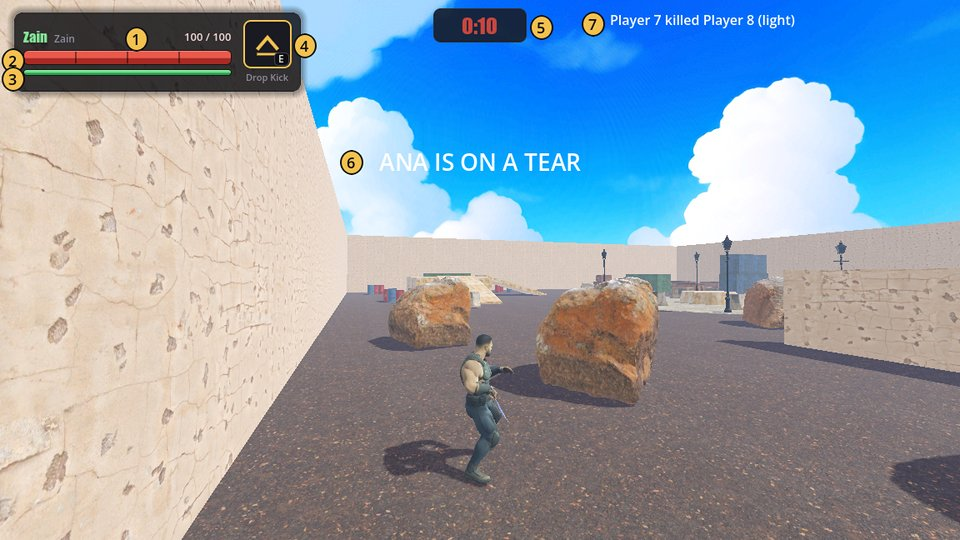
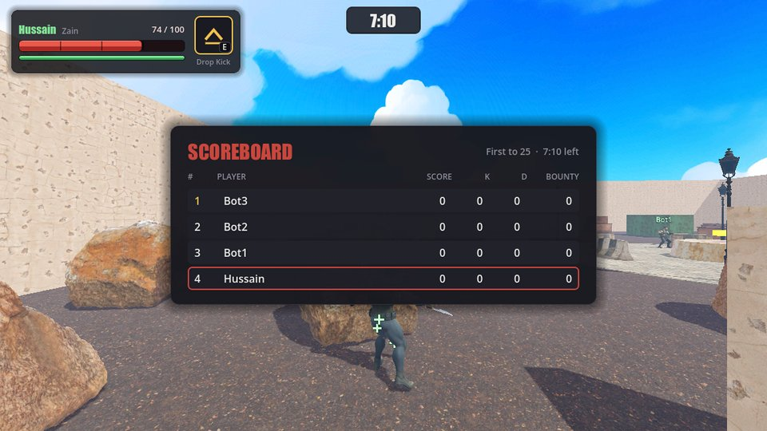

# The screen

What everything on your screen means during a match, plus the scoreboard and the results
screen.

| # | What it is |
|---|---|
| 1 | Your name and character |
| 2 | **Health**: 100 at full. A lighter chunk shows the damage you just took |
| 3 | **Stamina**: used by sprinting and rolling. It turns amber when you've run it dry |
| 4 | **Ability**: the key or button to use it, the seconds of cooldown left, a gold border when it's ready |
| 5 | **Match clock**: the time left. It turns red during [Last Call](match-rules.md#last-call) |
| 6 | **Announcements**: streaks, bounties, the Golden Knife, Last Call |
| 7 | **Killfeed**: who killed whom, and how |

## Scoreboard

Hold **Tab** (View on Xbox, Create on PlayStation) to see everyone's score, kills, deaths and
[bounty](match-rules.md#bounty). Your own row is outlined in red, and the leader's rank is
gold.

## Things you'll see in the arena

- **A column of gold light:** that player holds the Golden Knife.
- **Green + signs** over a player: they're [healing](combat.md#healing).
- **A shimmering player:** they just spawned and can't be hurt yet.
- **Blood** where a hit landed. It dries up after 3 seconds.

## Results screen

When the match ends you'll see the podium, the awards and the countdown to the next match.
See [Results and awards](match-rules.md#results-and-awards).

## See also

- [Match rules](match-rules.md)
- [Settings](settings.md)
