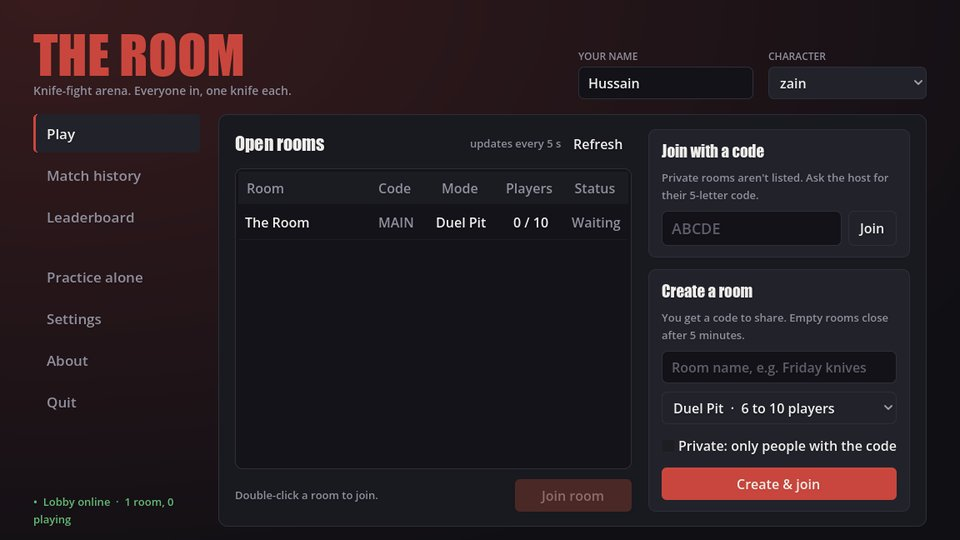

# Welcome

The Room is a fast third-person knife fight. Everyone spawns into one walled arena with one knife
and one special ability, and the first to the score target wins. This wiki explains everything
you need to play: the controls, how fights work, how points are scored, and the map.

## Quick start

1. Type your **name** at the top right of the main menu.
2. Press **Practice alone** to learn the controls with nobody around, or pick a room under
   **Play** and press **Join room**.
3. Stab people (left mouse), roll away from their stabs (Ctrl or Cmd), and grab the
   **Golden Knife** when it appears in the middle.

> **Tip:** you can read this wiki in the game at any time: **Wiki** in the main menu, or Esc →
> **Wiki** during a match. Use the search box to find any word.

## Contents

| Page | What it covers |
|---|---|
| [Getting started](getting-started.md) | Rooms, practice, joining friends, your first match |
| [Controls](controls.md) | Keyboard, mouse, Xbox and PlayStation controllers, rebinding |
| [Combat](combat.md) | Attacks, the roll, stamina, health and healing, dying and respawning |
| [Abilities](abilities.md) | Every character's special ability (Zain's Drop Kick) |
| [Match rules](match-rules.md) | Modes, scoring, bounty, the Golden Knife, Last Call, awards |
| [The arena](arena.md) | The map, its zones and how to use them |
| [The screen](hud.md) | What everything on your screen means, the scoreboard, results |
| [Settings](settings.md) | Display, graphics, controls and sound options |
| [Tips](tips.md) | How to win more fights |
| [Glossary](glossary.md) | Every game term in one place |
| [FAQ](faq.md) | Common questions |

## About the game

The Room is made by the **Voidra** team. Every character is a caricature of a real developer
on the team, and each one is designed by the person it's based on. Zain is the first.
