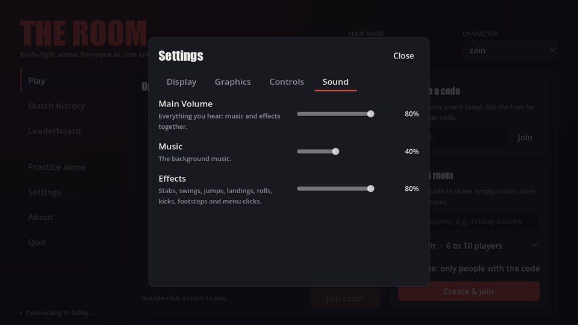

# Settings

Everything under **Settings**, in the main menu or the pause menu (Esc). Changes apply at once
and are remembered.

## Display

**Display Mode:** Maximized (the default: fills the screen but keeps the window frame), Windowed
or Fullscreen.

## Graphics

**Texture Quality:** Low, Mid (the default) or High.

- **Low** softens textures, for weaker graphics cards.
- **High** keeps floors and walls sharp even at a slant.

## Controls

See and change every binding for the device you're using. See
[Changing your controls](controls.md#changing-your-controls).

## Sound

| Slider | What it controls | Default |
|---|---|---|
| Main Volume | Everything | 80% |
| Music | The background music | 40% |
| Effects | Stabs, swings, jumps, landings, rolls, kicks, footsteps, clicks | 80% |

## See also

- [Controls](controls.md)
- [FAQ](faq.md)
